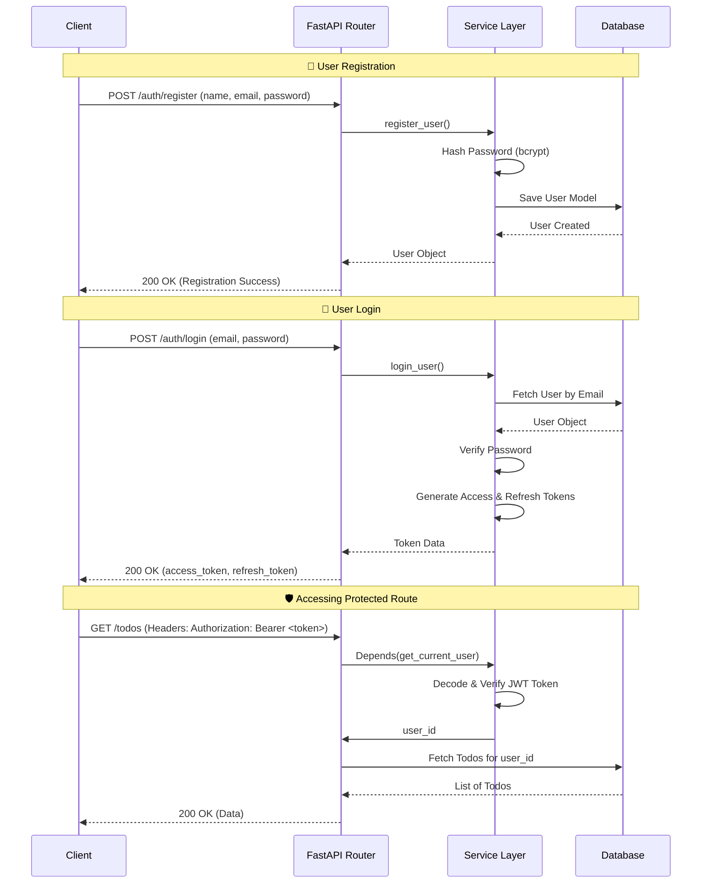

# FastAPI JWT Authentication Guide

This guide provides a detailed walkthrough of how authentication is implemented in this FastAPI application. You can use this structure to implement authentication in any other FastAPI project.

## 📌 Architecture Overview

The authentication system is built using **JWT (JSON Web Tokens)** and **OAuth2 with Password Bearer**.

### 🔄 Authentication Flow



---

## 🛠️ Step-by-Step Implementation

### 📦 Step 1: Install Dependencies
To handle password hashing and JWT tokens, install the following packages:
```bash
pip install passlib[bcrypt] python-jose cryptography email-validator
```

---

### 🗄️ Step 2: Database Model
Define a [User](file:///c:/Users/Admin/Downloads/todo-service-fastapi-main/todo-service-fastapi-main/app/models/user_model.py#7-15) model with ahashed password column.

**File:** [app/models/user_model.py](file:///c:/Users/Admin/Downloads/todo-service-fastapi-main/todo-service-fastapi-main/app/models/user_model.py)
```python
import uuid
from sqlalchemy import Column, String, Boolean
from sqlalchemy.dialects.postgresql import UUID
from app.database.database import Base

class User(Base):
    __tablename__ = "users"

    id = Column(UUID(as_uuid=True), primary_key=True, default=uuid.uuid4, index=True)
    name = Column(String, nullable=False)
    email = Column(String, unique=True, index=True, nullable=False)
    password = Column(String, nullable=False) # Stores hashed password
    is_verified = Column(Boolean, default=False)
```

---

### 🧩 Step 3: Pydantic Schemas
Define schemas for data validation during request and response.

**File:** [app/schemas/user_schema.py](file:///c:/Users/Admin/Downloads/todo-service-fastapi-main/todo-service-fastapi-main/app/schemas/user_schema.py)
```python
from pydantic import BaseModel, EmailStr

class UserCreate(BaseModel):
    name: str
    email: EmailStr
    password: str

class UserLogin(BaseModel):
    email: EmailStr
    password: str
```

---

### 🔒 Step 4: Password Security (Hashing)
Never store plain text passwords. Use `passlib` to hash and verify.

**File:** [app/utils/security.py](file:///c:/Users/Admin/Downloads/todo-service-fastapi-main/todo-service-fastapi-main/app/utils/security.py)
```python
from passlib.context import CryptContext
import hashlib

pwd_context = CryptContext(schemes=["bcrypt"], deprecated="auto")

def hash_password(password: str) -> str:
    # Optional: Pre-hash with SHA256 to avoid bcrypt 72-character limit
    sha = hashlib.sha256(password.encode()).digest()
    return pwd_context.hash(sha)

def verify_password(plain_password: str, hashed_password: str) -> bool:
    sha = hashlib.sha256(plain_password.encode()).digest()
    return pwd_context.verify(sha, hashed_password)
```

---

### 🎫 Step 5: Token Generation (JWT)
Create functions to encode access and refresh tokens.

**File:** [app/services/token_service.py](file:///c:/Users/Admin/Downloads/todo-service-fastapi-main/todo-service-fastapi-main/app/services/token_service.py)
```python
from jose import jwt
from datetime import datetime, timedelta
import os
from dotenv import load_dotenv

load_dotenv()

SECRET_KEY = os.getenv("SECRET_KEY") # Define in .env
ALGORITHM = "HS256"

def create_access_token(data: dict):
    to_encode = data.copy()
    expire = datetime.utcnow() + timedelta(minutes=30) # Access token expiry
    to_encode.update({"exp": expire})
    return jwt.encode(to_encode, SECRET_KEY, algorithm=ALGORITHM)

def create_refresh_token(data: dict):
    to_encode = data.copy()
    expire = datetime.utcnow() + timedelta(days=7) # Refresh token expiry
    to_encode.update({"exp": expire})
    return jwt.encode(to_encode, SECRET_KEY, algorithm=ALGORITHM)
```

---

### 🧠 Step 6: Auth Service (Business Logic)
Combine hashing and token services for business operations.

**File:** [app/services/auth_service.py](file:///c:/Users/Admin/Downloads/todo-service-fastapi-main/todo-service-fastapi-main/app/services/auth_service.py)
```python
from sqlalchemy.orm import Session
from fastapi import HTTPException
from app.models.user_model import User
from app.utils.security import hash_password, verify_password
from app.services.token_service import create_access_token, create_refresh_token

def register_user(db: Session, name: str, email: str, password: str):
    existing = db.query(User).filter(User.email == email).first()
    if existing:
        raise HTTPException(status_code=400, detail="Email already registered")

    new_user = User(
        name=name,
        email=email,
        password=hash_password(password)
    )
    db.add(new_user)
    db.commit()
    db.refresh(new_user)
    return new_user

def login_user(db: Session, email: str, password: str):
    user = db.query(User).filter(User.email == email).first()
    if not user:
        raise HTTPException(status_code=404, detail="User not found")

    if not verify_password(password, user.password):
        raise HTTPException(status_code=401, detail="Invalid credentials")

    access = create_access_token({"sub": str(user.id)})
    refresh = create_refresh_token({"sub": str(user.id)})

    return {
        "access_token": access,
        "refresh_token": refresh,
        "token_type": "bearer"
    }
```

---

### 🛡️ Step 7: Route Protection (Dependency Injection)
Create a dependency that decodes the token and verifies the user.

**File:** [app/utils/dependencies.py](file:///c:/Users/Admin/Downloads/todo-service-fastapi-main/todo-service-fastapi-main/app/utils/dependencies.py)
```python
from fastapi import Depends, HTTPException, status
from fastapi.security import OAuth2PasswordBearer
from jose import jwt, JWTError
import os

SECRET_KEY = os.getenv("SECRET_KEY")
ALGORITHM = "HS256"

# This specifies where the token is extracted from (Authorization header)
oauth2_scheme = OAuth2PasswordBearer(tokenUrl="/auth/login")

def get_current_user(token: str = Depends(oauth2_scheme)):
    try:
        payload = jwt.decode(token, SECRET_KEY, algorithms=[ALGORITHM])
        user_id = payload.get("sub")
        if user_id is None:
            raise HTTPException(
                status_code=status.HTTP_401_UNAUTHORIZED,
                detail="Invalid token"
            )
        return user_id
    except JWTError:
        raise HTTPException(
            status_code=status.HTTP_401_UNAUTHORIZED,
            detail="Invalid or expired token"
        )
```

---

### 🛣️ Step 8: API Routes

#### 1. Authentication Endpoints
**File:** [app/routes/v1/auth_routes.py](file:///c:/Users/Admin/Downloads/todo-service-fastapi-main/todo-service-fastapi-main/app/routes/v1/auth_routes.py)
```python
from fastapi import APIRouter, Depends
from sqlalchemy.orm import Session
from app.database.database import get_db
from app.schemas.user_schema import UserCreate, UserLogin
from app.services.auth_service import register_user, login_user

router = APIRouter(prefix="/auth", tags=["Authentication"])

@router.post("/register")
async def register(user: UserCreate, db: Session = Depends(get_db)):
    new_user = register_user(db, user.name, user.email, user.password)
    return {"message": "User registered successfully", "user_id": new_user.id}

@router.post("/login")
def login(user: UserLogin, db: Session = Depends(get_db)):
    return login_user(db, user.email, user.password)
```

#### 2. Protected Endpoints (e.g., Todos)
To protect a route, inject `Depends(get_current_user)`.

**File:** [app/routes/v1/todo_routes.py](file:///c:/Users/Admin/Downloads/todo-service-fastapi-main/todo-service-fastapi-main/app/routes/v1/todo_routes.py)
```python
from fastapi import APIRouter, Depends
from app.utils.dependencies import get_current_user

router = APIRouter(prefix="/todos", tags=["Todos"])

@router.post("/")
def create_todo(
    todo_data: dict, 
    user_id: str = Depends(get_current_user) # 🔒 Protected
):
    # user_id is now available!
    return {"message": "Todo created", "owner": user_id}
```

---

## ⚙️ Configuration (.env)
Ensure you have a `.env` file in your root directory:
```env
SECRET_KEY="your-super-secret-key-at-least-32-chars"
```
